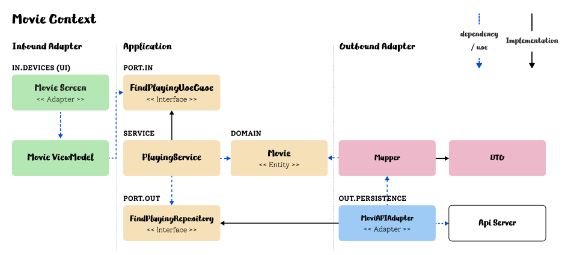

<span className="font-locus">2024.10.14. 작성 중 ..</span>

<br />

#CODE : [CLEAN_ARCHITECTURE](https://github.com/o-henry/clean_architecture)

<br />

## start

1.  영화 리스트를 제공하는 앱을 구현해봅니다.
    - 요구사항을 파악 해야합니다.
    - 현재 상영중인 최신 영화 정보를 확인하는 비즈니스만 구현해봅니다.
2.  높은 응집도와 낮은 결합도를 유지 해야합니다.
3.  테스트
    - 비즈니스 로직과 앱의 중요한 부분 위주로 테스트를 작성합니다.
    - 테스트 커버리지 퍼센티지에 연연하지 말고 서비스에 주요 비즈니스 로직에 집중합니다.
    - 예를들어 결제서비스 같은 경우 테스트 커버리지가 높을수록 좋겠죠?
4.  디자인 패턴과 SOLID 원칙
5.  유연한 코드 (변화에 대처하기 쉬운지)
6.  수정이 전파되어서는 안됩니다.
    - A를 수정했을 때 다른 곳의 수정이 동반되어서는 안됩니다.

<br />
<br />
<br />

## architecture

1. Clean Architecture with MVVM
   - 클린 아키텍처의 주요 규칙은 내부 레이어에서 외부 레이어로 종속성을 갖지 않는 것입니다.

<br />

현재 만들려고하는 영화서비스를 적용한 다이어그램을 그려보겠습니다.



이 다이어그램은 Hexagonal Architecture(Port and Adapter)를 얕게 도입한 접근입니다. 헥사고날 아키텍처는 클린 아키텍처 에서 좀 더 일반적인 용어로 설명한 것으로 동일한 원칙을 적용합니다.

위 다이어그램의 역할에 대해 설명 해보겠습니다.

- <span className="font-locus">인바운드 어댑터</span>는 UI를 표현하는 View와
  ViewModel이 속합니다.

- <span className="font-locus">유스케이스·인바운드 포트</span>는
  interface(protocol)로 정의되며 이를 통해 DIP가 적용됩니다.{' '}

- 하나의 <span className="font-locus">서비스</span>는
  하나의 유스케이스를 구현하고 이벤트에 따라 도메인 모델을 변경하고, 변경된 상태를 저장하기 위해 아웃바운드 포트를 호출합니다.

- <span className="font-locus">도메인·엔티티</span>
  비즈니스 맥락에서 도메인은 주요 활동, 즉 고객에게 제공하는 서비스를 포괄하며
  이를 도메인이라고 합니다. 테슬라는 전기차 분야에서 · 넷플릭스는 OTT서비스를 ·
  스타벅스는 커피를 제공합니다. 이러한 도메인은 여러개일 수 도 있습니다.
  비즈니스 영역은 상당히 복잡하고 추상적인 개념을 포함합니다.{' '}

      > 이와 관련된 더 상세한 내용은 DDD를 학습하면 됩니다.

- <span className="font-locus">아웃바운드 포트</span>이 레이어 에는 Repository
  같은 인터페이스가 위치합니다. > Repository에 모든 메서드를 정의하는 거대한
  인터페이스를 사용할 경우 추후 코드가 복잡해지면 응집도가 떨어지게 됩니다.이에
  따라 나중에 ISP 적용을 고려해야 합니다.

- <span className="font-locus">아웃바운드 어댑터·인프라스트럭처</span>이
  레이어는 아웃바운드 포트(리포지토리)를 구현하는 구현체가 됩니다.{' '}

<br />
<br />
<br />

## data flow

위 다이어그램 기준으로 코드 실행 과정을 살펴보면

1. View(UI)에서 버튼클릭 같은 액션을 통해 이벤트를 발생시킵니다.
2. 클릭 이벤트는 UI에 연결된 함수를 호출합니다. 우리 앱은 MVVM을 따르므로 ViewModel에 함수가 정의되어 있습니다.
3. ViewModel에서 호출된 함수는 유스케이스를 호출합니다.
4. 서비스는 유스케이스(인커밍 포트)를 구현하고 아웃바운드 포트를 호출하여 도메인 모델 변경을 실행합니다.
5. 아웃바운드 포트(리포지토리 등)를 통해 아웃바운드 어댑터(API, DB)가 실행되고 원하는 데이터를 반환합니다.
6. 정보가 다시 View로 이동하여 아이템 리스트를 표시합니다.

> 여기서 사용자(View)는 메서드 호출만 할 뿐 2,3,4 번의 과정을 알지 못합니다.

<br />
### feature grouping

    * 기능별로 파일을 분리하면 같은 목적의 코드들이 포함되어 있기 때문에 높은 응집도 와 낮은 결합력 유지하게 됩니다.
    * feature grouping의 단점은 계층에 의한 패키징 방식 보다 아키텍처 가시성을 떨어트린다는 단점이 있습니다.
    * 아래 구조는 헥사고날 아키텍처를 적용한 구조 입니다.

```swift showLineNumbers
Movie
├── Playing
│   ├── Adapter
│   │   ├── In(UI)
│   │   │   ├── View
│   │   │   └── ViewModel
│   │   └── Out(Infra)
│   │       ├── DTO
│   │       └── API(Outbound Port의 구현체)
│   └── Application
│     ├── Port
│     │   ├── In
│     │   │   └── UseCase
│     │   └── Out
│     │       └── Port
│     └── Service(Inbound Port의 구현체)
├── Core
│   └── Domain
│       └── Entity    
└── Preview Content
        └── Preview Assets.xcassets
            ├── Contents.json
            └── Movie.json
```

<br />
<br />
<br />

## recognize user story

앱의 비즈니스 도메인을 식별하는 방법은 사용자의 관점으로 접근하는 것 입니다.
User Story는 사용자 관점으로 소프트웨어(앱)의 기능에 대한 설명을 캡처하는 방법입니다. 이 스토리에는 기술적 요소는 포함되지 않아야 하며 사용자가 원하는 동작에 대해서 집중해야 합니다.

- 사용자는 최신 영화 정보를 확인할 수 있습니다.
- 사용자는 영화를 관람 후 평가를 내릴 수 있습니다.
- 사용자는 영화 리뷰를 남길 수 있습니다.

이를 통해 Use Case도 식별할 수 있습니다.

<br />
<br />
<br />

## recognize domain

1. 우선 애플리케이션을 빌드하는데 필요로하는 기능을 식별합니다. 기능을 식별한 후에 UI를 레이아웃하고 각 기능에 따른 뷰를 배치합니다.
2. 도메인 모델을 식별하는 가장 쉬운 방법은 서버의 API를 확인하는 것입니다. 대부분의 경우 앱에는 데이터를 처리할 수 있는 백엔드 웹 서비스가 있습니다. 백엔드 모델을 일치시키면 일반적으로 JSON에서 도메인으로 변환할 수 있습니다.
3. 다만 이러한 방식의 문제점은 엔티티가 api 종속적인 즉, api스펙에 따라 변경된다는 문제가 발생합니다. 이에 따라서 DTO를 활용하는 방법도 있습니다.

> DTO는 다른 클래스혹은 계층으로 데이터를 전달할 때 도메인 모델 대신 사용되는 불변 객체 입니다. DTO는 클라이언트 요청에 포함된 데이터를 담아 서버 측에 전달하고, 서버 측의 응답 데이터를 담아 클라이언트에 전달하는 계층간 전달자 역할을 합니다.

> Q. 구현한 도메인과 백엔드 API와 차이가 있다면?  
>  A. DTO와 MAPPER를 활용합니다.

<br />

**NOW PLAYING** 1. <span className="high-light">현재 상영중인 최신 영화 정보를 확인할 수 있어야 합니다.</span>

> 위의 도메인은 간소화한 예제 이며 유저스토리와 DDD의 이벤트 스토밍 등을 통해서 더 명확한 비즈니스 모델과 도메인을 식별할 수 있습니다.

<br />
<br />
<br />

## use case

> UseCase 계층은 어플리케이션에 특화된 비즈니스 규칙을 포함하며, UseCase는 Entity와 주고받는 데이터의 흐름을 조정하고, Entity가 UseCase의 목표를 달성하기 위해 범용 비즈니스 규칙을 사용하도록 지시합니다.

유스케이스가 하는 일은 아래와 같습니다.

1. 인커밍 어댑터(UI)로부터 입력을 받습니다. (SwiftUI에서 유저 액션)
2. 비즈니스 규칙을 검증합니다.
3. 모델 상태를 조작합니다.
   - 유스케이스는 위 입력을 기반으로 모델의 상태를 변경할 수 있습니다.
   - 네트워크(API) 어댑터를 통해 구현된 포트(FindPlayingPort)로 이 상태를 전달해서 값을 반환 받을 수 있게 합니다.
   - 유스케이스는 또 다른 아웃바운드 어댑터를 호출할 수 있습니다.
4. 출력을 반환합니다.
   - 아웃바운드 어댑터에서 온 출력값을 유스케이스를 호출한 어댑터(UI)로 반환할 출력 객체로 변환합니다.

> Use Case는 protocol(interface의 역할)로 구성됩니다.

위에 유스케이스가 하는 일 중 비즈니스 규칙 검증에 대해서 말했었습니다. Use Case 내부에 검증로직을 정의하면 이를 사용하는 곳에서 개별적으로 검증할 필요가 없어집니다.
이는 중복코드가 감소함을 의미합니다.

> 사실 이러한 입력 유효성 검증의 경우 비즈니스 검증을 해야하는 유스케이스가 아닌 다른 레이어의 책임이라고 합니다. 여기서 CQRS를 도입해서 하기도 하는데 개발 초기에는
> 이러한 부분까지 신경써서 하다보면 복잡성의 증가와 오버 엔지니어링이 된다고 생각하기 때문에 나중에 필요할 때 리팩토링 하는 접근을 하겠습니다.

이러한 방식의 접근은 외부 API 변경이나 인프라 변경 같은 변화에 대응하기가 쉬워집니다. 해당 유스케이스를 사용하는 사용자는 외부요소가 변경되어도 이전에 사용하던 방식 그대로 사용할 수 있기 때문입니다.
구현체만 변경하면 됩니다.

영화 서비스에서 유스케이스는 "사용자는 최신 영화 정보를 확인할 수 있습니다" 에서의 동작인 "최신 영화 정보 확인"을 표현하는 인터페이스를 구현합니다.

<br />
<br />
<br />

## walking skeleton

워킹 스켈레톤은 작은 종단 간 기능을 수행하는 시스템의 작은 구현체입니다. 최종 아키텍처를 사용할 필요는 없지만 주요 아키텍처 구성 요소를 서로 연결해야 합니다. 그런 다음 아키텍처와 기능은 병렬로 진화할 수 있습니다. 이를 구현하면 보다 쉬운 테스트가 가능해집니다.

> 각 레이어에서 작동하는 작은 단위의 모듈을 생성합니다. 이는 더 쉬운 테스트를 할 수 있게 도와줍니다.

- 외부 REST API(영화 API)를 활용합니다. 이에 따른 Configuration을 준비합니다.
- 영화 데이터를 가져오기 위해서 API KEY를 추가합니다.
  **API KEY 관리**
  API KEY는 시크릿 키 이기 때문에 깃허브에 올리기전에 숨겨야 합니다.
  이를 구현하기 위해 `.xcconfig` 를 활용합니다.
- 도메인 모델의 Mock.json을 생성해봅니다.

  Q. Mock.json 을 생성하는 이유는?  
  A. 개발중에 앱을 실행할 때 외부 데이터에 의존하지 않고 비즈니스 로직을 테스트하고 디자인을 반복(preview) 하는데 유용하기 때문입니다.

  Mock.json은 앱 파일의 Preview Content 내부에 생성합니다. Mock의 경우 API의 Response를 사용하면 됩니다.

  > xcode에 `Preview Content` 폴더(그룹)에 Mock.json 파일을 추가하여 사용합니다. 여기에 Xcode 프리뷰에 사용할 mock 코드와 데이터를 추가할 수 있습니다. 나중에 앱을 컴파일할 때 Xcode는 빌드에 이 그룹의 컨텐츠를 포함하지 않습니다. 이렇게 하면 이미지 및 기타 데이터와 같은 개발 에셋을 프로젝트 내부에 저장할 수 있으며, 앱을 어수선하게 만드는 것에 대해 걱정할 필요가 없습니다.

- <span className="high-light">
    API 요청이 동작하는지 확인하기 위해 요청/응답 부분을 우선 구현합니다.
  </span>

<br />
<br />
<br />

## outbound port

위에서 유스케이스는 아웃바운드 포트를 호출하여 도메인 모델 변경을 실행한다고 했습니다.  
현재 앱기능은 API서버 에 요청을 해서 데이터를 받는 과정이 필요합니다. 네트워크(API) 어댑터를 통해 구현된 포트로 이 상태를 전달해서 값을 반환 받을 수 있게 합니다.

<br />
<br />
<br />

## test

- 테스트 커버리지에 대해 고민해보기
- unit-test의 경우 swift testing을 사용하고 UI test의 경우 기존 XCTest를 활용합니다.
- 자동화 테스트의 종류가 많습니다. UI를 캡처해서 실제 UI와 앱이 어느정도로 비슷한지도 테스트할 수 있는걸로 알고있습니다.
- 앱의 접근성을 활용하여 UI 테스트를 구현합니다.

<br />
<br />

<br />
